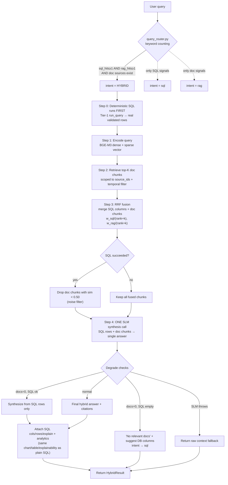

# Existing Hybrid Pipeline — How It Works Today (As-Is Analysis)

This documents the CURRENT behavior of the hybrid pipeline as it exists in code today —
no proposed changes. Source files: `veda_core/veda_hybrid.py`, `veda_core/query/rag_layer.py`,
`veda_core/query/query_router.py`, `veda_core/retrieval/retrieval_engine_phase3.py`.

---

## 1. How a query reaches the hybrid pipeline

A query only enters the hybrid pipeline if the **router classifies its intent as `"hybrid"`**.
That decision happens in `query_router.py`, based purely on keyword counting:

- `sql_hits`   = count of `_SQL_KEYWORDS` (+ temporal keywords ×2) in the query
- `rag_hits`   = count of `_RAG_KEYWORDS` in the query
- Intent becomes **`"hybrid"`** when `sql_hits >= 1 AND rag_hits >= 1 AND document sources exist`
  (i.e. the query shows BOTH structured-data signals and document signals at once).

So "hybrid" is triggered when the query looks like it needs a database answer AND a document
answer together — e.g. *"what does the late-payment policy say and how many tenants violated it"*.

---

## 2. What the hybrid pipeline actually does (step by step)

Entry: `veda_hybrid.py` (intent == "hybrid" branch) → `rag_layer.py::run_hybrid_layer()`.

1. **Deterministic SQL runs FIRST** (`veda_hybrid.py`) — Tier-1 `run_query()` executes the actual
   SQL against the DB and returns real, validated rows. The LLM never writes this SQL. These rows
   become the "ground truth" fed into the fusion.

2. **Encode the query** (`rag_layer.py` Step 1) — BGE-M3 produces a dense vector + a sparse vector
   of the query (with value-expansion).

3. **Retrieve document chunks** (Step 2) — `retrieve_top_k_chunks()` pulls the top-K doc chunks
   for that query vector, scoped to the request's `source_ids`, with the temporal filter applied.

4. **RRF fusion** (Step 3, `_rrf_fuse_hybrid()`) — SQL columns and doc chunks are merged with
   Reciprocal Rank Fusion:
   - each SQL column scored `w_sql / (rank + k)`, each doc chunk `w_rag / (rank + k)`
   - combined, sorted by RRF score, then split back into a top SQL-column list + top doc-chunk list
   - both types are guaranteed representation in the final context.

5. **Noise filter** (only when SQL succeeded) — doc chunks with `similarity < 0.50`
   (`_MIN_DOC_SIM_WITH_SQL`) are dropped, so weak documents can't make the LLM override a solid
   SQL answer with "no information found".

6. **Single SLM synthesis call** (Step 4) — `_build_hybrid_user_message()` packs the executed SQL
   rows + the surviving doc chunks into ONE prompt; `_call_ollama()` produces the final natural-
   language answer with document citations.

7. **Attach SQL artifacts back** (`veda_hybrid.py`) — the SQL head's own `cols` / `rows` /
   `explain` and analytics (`analyze_result`) are attached to the hybrid result, so the answer
   still gets the same chart/table/explainability a plain SQL answer would.

### Fallback / degrade paths
- **Docs = 0 but SQL succeeded** → synthesize from SQL rows only (no docs).
- **Docs = 0 and SQL failed/empty** → return "no relevant document content" + suggest the top
  relevant DB columns; intent silently degrades to `"sql"`.
- **SLM synthesis throws** → return raw context (DB columns + doc snippets) instead of failing.

---

## 3. Diagram — Existing Hybrid Pipeline

---

## 3b. Datalake sources in the hybrid pipeline

Datalake sources (parquet / CSV / Delta / Iceberg) participate in hybrid the same way relational
sources do, with two differences:

- **Router** (`query_router.py`): datalake is treated as SQL-capable — `sql_capable_ids =
  relational_ids + datalake_ids`, and hybrid intent pulls from `sql_capable_ids + document_ids`.
  So a datalake source's SQL side + document chunks can be fused together in hybrid.
- **Deliberate exclusion**: datalake is **excluded from pure `"sql"` intent** (only `relational_ids`
  are used there). Reason in code: datalake CSV columns (e.g. permissions exports) pollute the
  retrieval top-K for generic status/state queries. Datalake only joins the SQL side inside the
  explicit hybrid (SQL+doc fusion) path.
- **Execution** (`veda/execution.py`): a datalake source has no relational DB, so its SQL runs on
  **DuckDB** over the materialized parquet (`_execute_duckdb` → `read_parquet`), while purely
  relational scopes keep the psycopg2 fast path. The hybrid Step-0 deterministic SQL is routed to
  DuckDB automatically for these sources.

Net: hybrid's flow (SQL executes first → RRF fusion → single synthesis) is identical for datalake;
only the execution engine (DuckDB vs psycopg2) and the pure-SQL exclusion differ.

## 4. Key observations about the current design

- **"Hybrid" is triggered by keyword co-occurrence only** — no semantic understanding of whether
  the query genuinely needs both a DB answer and a document answer. A stray keyword overlap can
  force hybrid; a domain-specific phrasing with no listed keywords can miss it.
- **SQL is the source of truth** — it executes first, deterministically, and the LLM only fuses/
  narrates. This is the strong part of the design.
- **The document side is single-shot** — one retrieval + one synthesis call, no re-check that the
  generated answer's claims are actually supported by the retrieved chunks.
- **Fusion is a fixed heuristic** (RRF with fixed weights + a fixed 0.50 similarity cutoff) — not
  query-adaptive.
- **Source selection is by source-TYPE only** — hybrid pulls from all document sources in scope;
  it does not distinguish between multiple document sources of the same domain.
