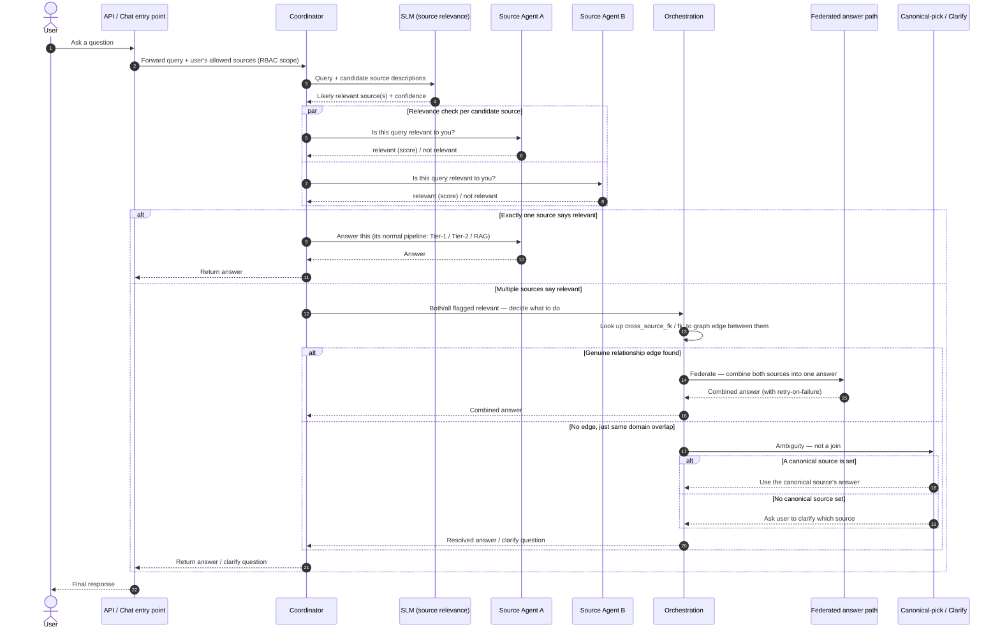

# Intent + Source Routing Fix — Detailed Task Breakdown (for PM)

## Context
Query routing currently uses a hardcoded keyword-counting heuristic (`query_router.py`) to decide
SQL/RAG/Hybrid/NoSQL intent and which source(s) to query. This causes two known problems:
1. A query meant for one source (e.g. a filesystem/doc source) can bleed into irrelevant sources.
2. When a query genuinely needs data from multiple sources combined, the system doesn't reliably
   detect and execute that combine.

Decision: move to a **multi-agent architecture — one agent per source**. One coordinator (an
SLM-based router) decides which source-agent(s) are relevant to a query. Each source's existing
deterministic pipeline (Tier-1 / Tier-2 / RAG) becomes that source's own "agent" — wrapped with a
lightweight relevance-check, not rewritten. No change to how any single source answers a query
once selected; only how sources are selected and combined changes.

```
Query → Coordinator (SLM router)
          ├─ Source A agent: relevance check → [answer if relevant]
          ├─ Source B agent: relevance check → [answer if relevant]
          └─ Source C agent: relevance check → [answer if relevant]
       → if 1 relevant   → that agent's answer, as-is
       → if multiple relevant → orchestration: genuine combine (federate) or pick canonical / clarify
```

Timeline assumes AI-assisted development (most boilerplate/migration/plumbing written with AI
help, engineer reviews + tests + tunes thresholds). Small-startup pace: one engineer, working days.

## Sequence Diagram — How a Query Flows Through the New Design



**Reading it in one line:** every query hits the coordinator, which asks the SLM which source(s)
look relevant — then each candidate source silently confirms yes/no to "is this mine to answer,"
and only when more than one says yes does the orchestration logic (federate vs. canonical-pick vs.
clarify) ever run.

---

## Task 1 — Source Profiling (0.5 day)
- Add `domain_tags`, `description`, `is_canonical` fields + migration
- Add fields to registration form / admin
- Auto-generate `description` post-ingestion when left blank
- `is_canonical` — manual toggle only, no auto-inference
- Verify: new same-type source instance needs zero extra work

## Task 2 — Source Agent Wrapping (1 day)
- Define relevance-check interface (query + source → relevant/not + confidence)
- Implement for relational/datalake sources (reuse existing retrieval-score)
- Implement for document sources (reuse existing RAG chunk-similarity)
- Wire existing pipelines (Tier-1/Tier-2/RAG) behind the relevance-check
- Verify: wrapper is generic, no per-source custom code needed

## Task 3 — Smart Query Coordinator (1.5 days)
- Keep keyword fast-path for clear-signal queries, unchanged
- Define ambiguous-case trigger (weak/close scores → hand off)
- Build SLM fallback call (structured in/out: query + source descriptions → relevant source(s))
- Wire in Task 2's relevance-checks as the dispatch mechanism
- Add single-relevant-source short-circuit (skip orchestration entirely)

## Task 4 — Cross-Source Orchestration (1.5 days)
- Detect trigger: coordinator returns multiple relevant source-agents
- Look up existing `cross_source_fk` / `fk_to` graph edges between candidates
- Edge found → route to federated path (Task 5)
- No edge + same domain tag → pick `is_canonical` source
- No canonical set → return clarify response instead of guessing

## Task 5 — Federated Answer Hardening (1 day)
- Capture specific failure reason from SQL/plan generation (parse/exec error)
- Add bounded retry loop, feeding the failure reason back in
- Reuse existing Tier-2 repair-retry pattern (`_max_repairs`-style)
- Verify: final-attempt failure still falls through to a clean refuse

## Task 6 — Validation & Benchmarking (1.5 days)
- Curate one query-set: single-source-only, genuine multi-source, same-domain ambiguity
- Run OLD routing path → record baseline accuracy + latency
- Run NEW coordinator + agent + orchestration path
- Compare accuracy %, latency delta, per-scenario correctness
- Package before/after numbers into a summary for lead/PM

---

## Total Estimate
**~7 working days (~1.5 weeks)**, one engineer, AI-assisted coding.
Testing runs alongside each task as it lands rather than only at the end, so this is closer to a
1.5-week wall-clock than seven purely additive days.

## Suggested Order
Task 1 → 2 → 3 → 4 → 5, validating each as it lands, with a final end-to-end pass at the close.
Every task ships behind its own config flag, default OFF, so production stays unchanged until
each piece is validated and switched on — existing project convention, no separate task needed.

## New Source Onboarding — What Happens Automatically
- Sequence: register (`ready=False`), optional manual `description` → ingestion runs (existing
  pipeline, unchanged) → if `description` is still blank, auto-generate it from ingestion output →
  admin sets `domain_tags` / `is_canonical` (manual, business judgment) → `ready=True`.
- Nothing routes to a source before `ready=True` — the same gate the query path already respects;
  the new agent/coordinator layer depends on it rather than bypassing it.
- Cross-source edge discovery already runs automatically on every ingestion, across all ready
  sources — unchanged by this work.
- The coordinator reads the source registry live, not a hardcoded list — a new source becomes
  routable the moment it's tagged and ready, with no code change.
- Until tagged, a new source defaults to its own distinct domain — it never silently overrides an
  existing canonical source; a genuine overlap before tagging triggers a clarify, not a guess.

## Scope Note — New Source Instance vs. New Source Type
- A new **instance** of an already-supported type (another database, another document folder) is
  free under this plan — the agent-wrapper is generic per pipeline-type.
- A genuinely new source **type** (e.g. a graph database, a streaming source — anything with no
  existing connector/answering-pipeline) is **out of scope here**. That requires its own connector
  and answering pipeline first, as a separate, independently-scoped effort — only once that exists
  does the same agent-wrapper pattern apply to it for free.

## Explicitly Out of Scope for This Pass
- Query-time re-verification of lower-confidence cross-source graph edges (a separate reliability
  follow-up).
- Compound "dependent" sub-queries, where one sub-query's result feeds another — a different,
  already-known gap, unrelated to source routing.
