# RBAC & AUTHENTICATION — VEDA Platform

**Scope.** The two apps that decide *who a caller is* and *what they may reach*:
`apps/authentication` (identity verification) and `apps/access_management` (identity
administration + authorization). Expands [ARCHITECTURE.md](ARCHITECTURE.md) §9. The
resource-path grammar has its own record in
[adr/0001-rbac-resource-path.md](adr/0001-rbac-resource-path.md) — this document
cross-references it rather than restating it.

**Basis.** Written from a direct read of `apps/access_management/`,
`apps/authentication/`, the auth-relevant parts of `apps/core/`, the Gate 1 wiring in
`apps/query/` + `apps/chat/`, `veda_core/veda/rbac_filter.py`, and `config/settings/*`
on 2026-09-09. Line references are repo-relative and drift — treat them as anchors.

> **Authority.** When this document and the code disagree, the code wins. The
> single-query resolver in `apps/access_management/services/resolver.py` is
> authoritative for every allow/deny decision; `config/settings/base.py` for which
> flags are set; the migrations for what physically exists in `veda`.

> **The user's open snippet is a different codebase.** A `launchpad` database alias,
> an `authentication.identity_management` module, and `is_locked` /
> `password_attempts` / `last_failed_attempt` columns on a user model **do not exist
> anywhere in veda-platform** and never have. This platform does per-account lockout
> in Redis (`AuthService._is_locked`, §5.4), keeps the stock
> `django.contrib.auth.User` unchanged, and has no identity DB router. `launchpad`
> appears in this repo only as the name of a **test source** in
> `scripts/test_filesystem_rbac_live.py:258` (a resource path, not a database). Do
> not go looking for that snippet's schema here.

---

## 0. Executive summary

| Layer | State (verified in code) |
|---|---|
| **Gate 2** — admin-API authorization | Wired onto **every** `AdminView` alongside `IsAdminUser` (`views/base.py:99`). No-op unless `VEDA_RBAC_MODE ∈ {shadow, enforce}`. `gate.py`. |
| **Gate 1** — data-path authorization | Wired into `apps/query/views.py` + `apps/chat/views.py`: source-level narrowing (403 early) + a table/column `X-Veda-Data-Scope` payload the engine applies in `veda/rbac_filter.py`. Active only when `VEDA_RBAC_MODE != off`. The `/api/v1/query` view class itself is still `permission_classes = [AllowAny]`. |
| **JWT authentication class** | Prepended to DRF `DEFAULT_AUTHENTICATION_CLASSES` only when `VEDA_JWT_AUTH=1` (`config/settings/base.py`). Default **off** → login returns `"dummy_access_token"`, refresh 401s. |
| **Permission cache** | Not built. The resolver runs one query per request, cached only on the `request` object (`gate.py:136`). |
| **Audit trail** | Not built. `granted_by` (SET_NULL) is the only durable record of who conferred authority. "M8" in `AUTH_ISSUES_BACKLOG.md` is referenced by three modules; **that file does not exist**. |

Everything in both apps is **built, wired end-to-end, and flag-gated off by
default** (§8). `VEDA_RBAC_MODE` and `VEDA_JWT_AUTH` are the two switches.

Related contracts (root of repo, all marked "living document" and all somewhat
behind the code): [`../ACCESS_MANAGEMENT_API_CONTRACT.md`](../ACCESS_MANAGEMENT_API_CONTRACT.md),
[`../AUTH_API_CONTRACT.md`](../AUTH_API_CONTRACT.md),
[`../RBAC_PROGRESS_LOG.md`](../RBAC_PROGRESS_LOG.md) (its snapshot table still says the
data path is ungated — it is not, see §6).

---

## 1. The two-app split

Two deliberately separate bounded contexts, added since `ARCHITECTURE.md`'s original
draft:

| | `apps/authentication` | `apps/access_management` |
|---|---|---|
| Question | "Is this caller who they claim to be?" | "May this identity exist / do this?" |
| Owns | login, refresh, logout, password-change; JWT via `simplejwt`; Redis lockout | User/Role/Permission/CatalogResource + two grant edges; the resolver; Gate 1 + Gate 2; admin CRUD |
| Models | **none** | 6 (`models/`) — none tenant-scoped |
| URL prefix | `/api/v1/auth/…` | `/api/v1/…` (users, roles, permissions, catalog, grants, resolver) |
| Flag | `VEDA_JWT_AUTH` (default off) | `VEDA_RBAC_MODE` (default off) |

The two never import each other. Their **only** shared code is the leaf
`apps/core/token_revocation.revoke_all_refresh_tokens(user_id)` — needed by
`authentication` (replay defence, password change) and by `access_management`
(user deactivation), so neither app has to reach into the other
(`apps/core/token_revocation.py:1-14`).

URL roots (`config/urls.py`): `/admin/`, `/api/v1/` (includes `apps.query`,
`apps.chat`, `apps.authentication`, `apps.access_management`, `apps.sources`),
`/healthz`, `/readyz`, `/metrics`.

---

## 2. The RBAC data model (ER)

```
django.contrib.auth.User  (stock, unswapped — migration 0001 asserts swappable_dependency)
  │ 1:1
  ▼
UserProfile ─── deleted_at            models/profile.py
  (OneToOneField, CASCADE; deleted_at = timestamp-on-decision, mirrors is_active;
   backfilled lazily via get_or_create)

User ──<  UserRole  >── Role                                   models/grants.py:59
          user  → CASCADE   (an assignment without its user is meaningless)
          role  → PROTECT   (a held role cannot be deleted)
          granted_by → SET_NULL, related_name="+"   (losing the admin ≠ losing the grant)
          UNIQUE(user, role)                                   models/grants.py:80

Role ──<  RolePermission  >── Permission                       models/grants.py:97
          role       → CASCADE   (a role's grants are part of the role)
          permission → PROTECT   (catalogue is seeded, never deleted)
          resource_path : CharField(512)   ← NOT a FK          models/grants.py:109
          effect        : "allow" | "deny" (default allow)     models/grants.py:111
          granted_by    → SET_NULL
          UNIQUE(role, permission, resource_path)              models/grants.py:127
              ↑ effect deliberately NOT in the key — re-granting the opposite
                effect UPDATES the row in place, never adds a contradictory second

Role         name (CI-unique via UniqueConstraint(Lower("name"))) | description
             | is_active | deleted_at                            models/roles.py
Permission   code (CI-unique, dotted "domain.action")            | name
             | description | is_active                           models/permissions.py

CatalogResource                                                  models/catalog.py:63
  path         canonical, UNIQUE      ("db:crm:employee:salary")
  kind         db | nosql | files | lake   (denormalized from path[0])
  parent_path  indexed, "" for a source-level row
  source       FK → sources.Source, PROTECT   ← the ONE real FK here
  substrate_id UUIDField, plain column, NOT a FK   (substrate is dropped+recreated
                 every re-ingestion — a FK would cascade-kill or dangle every grant)
  is_active    discovery deactivates vanished resources, NEVER deletes
  INDEX(source, is_active)
```

**No tenant column on any RBAC model.** Tenancy is explicitly deferred
([ADR-0001](adr/0001-rbac-resource-path.md) §7). `data_scope.py` and the catalog
discovery service read the substrate with `all_tenants()` precisely because a
resource path carries no tenant and those services run with no ambient
`veda_core.context`.

**Grant shapes actually used:**

- **Global** (`resource_path=""`) — for non-resource-scoped permissions
  (`user.manage`, `role.manage`, `query.execute`). The seeded Admin role's grants
  are all this shape.
- **Resource-scoped** `data.read` on a `db:<source>` / `:table` / `:column` path
  with `effect=allow|deny`. Recommended pattern (`data_scope.py` docstring):
  **whole-source ALLOW + narrower DENY carve-outs.**

`granted_by` is the only audit record — there is no history/event table. Every
service emits one `request_id=… actor=…` log line (`views/base.py:79`
`log_context`) that a future audit sink "should write to".

---

## 3. The resolver — one query, deny-wins, strict hierarchy

`apps/access_management/services/resolver.py`. `PermissionResolver.resolve(user)`
→ an immutable `EffectivePermissions` value object.

**One query** (`resolver.py:249`):

```python
RolePermission.objects.filter(
    role__user_assignments__user_id=user_id,
    role__is_active=True,
    permission__is_active=True,
).values_list("permission__code", "resource_path", "effect")
```

Inactive user, role or permission is filtered **in the database**, not in Python,
so a disabled capability cannot leak through a caller that forgot to check.
Anonymous / missing / **inactive** user → the shared `NO_PERMISSIONS` sentinel
(`resolver.py:205, 236`). `resolve_for_user_id()` (the admin "explain access"
endpoint) deliberately does **not** re-check `is_active` — an admin screen wants
"what would this user get if enabled".

### 3.1 `EffectivePermissions.allows(code, resource_path)` — the decision

```
                       allows(code, path)
                              │
              matched = grants for `code` whose
              resource_path is a prefix-or-equal of `path`
              (rp.prefixes(path) → ≤ 8 exact strings)
                              │
              ┌───────────────┴───────────────┐
              │ any matched grant effect==deny │──► return False   (deny-wins,
              └───────────────┬───────────────┘     unpierceable at any depth)
                              │ no
              ┌───────────────┴───────────────┐
              │ path is blank ("")?           │──yes──► return (any matched ALLOW)
              │  (non-resource-scoped perm)   │         no hierarchy to gate
              └───────────────┬───────────────┘
                              │ no  (path names a resource)
                              ▼
              source_prefix = rp.prefixes(path)[0]     ("db:<source>")
              return True  iff  some matched grant has
                     resource_path == source_prefix  AND  effect == ALLOW
                              │
              STRICT HIERARCHY: a deeper ALLOW (db:src:table) with NO
              source-level ALLOW above it grants NOTHING.
```

`resolver.py:121-134`. A blank-path grant is never a prefix of a real path
(`resource_path.prefixes()` starts at `MIN_SEGMENTS`), so a global `data.read`
grant does **not** silently open every table — fail-closed reading of
[ADR-0001](adr/0001-rbac-resource-path.md) §3.4.

### 3.2 Two worked examples

| Grants held by the user's active roles | `allows("data.read", …)` |
|---|---|
| `ALLOW db:crm:employees` **only** | `db:crm:employees` → **False**. No source-level (`db:crm`) ALLOW above it — strict hierarchy denies. The role has zero reachable sources and is rejected upfront (§6). |
| `ALLOW db:crm` + `DENY db:crm:salaries` | `db:crm:employees` → **True** (source ALLOW, no deny on the chain). `db:crm:salaries` → **False** (deny-wins). `db:crm` → **True**. |

### 3.3 The rule is reimplemented in three places — keep them in sync

| Location | Role | Note |
|---|---|---|
| `resolver.py:95` `EffectivePermissions.allows` | the authority | carries the full reasoning |
| `apps/query/scope.py:198` `permitted_source_ids` | coarse source gate | counts only 2-segment (`db:<source>`) ALLOW grants; `resolver.py:118` says these MUST change together |
| `apps/access_management/services/catalog.py:479` `CatalogService._resolve_effect` | admin tree overlay | a live drift bug (parent-DENY + child-ALLOW rendered green) was fixed 2026-08 (`catalog.py:481`) |

---

## 4. `VEDA_RBAC_MODE` — off / shadow / enforce

`apps/access_management/gate.py:52` `rbac_mode()`. Default `off`. An unrecognised
value logs an error and falls back to `off` (never guesses `enforce` — that would
take a deployment offline).

| Mode | Gate 2 | Gate 1 |
|---|---|---|
| `off` | `has_permission` returns `True` immediately (`gate.py:86`) — byte-identical to before the gate existed | `resolve_effective_permissions` returns `None` (`data_scope.py:109`); every narrowing helper is a no-op |
| `shadow` | decides, then **allows anyway**; logs `WARNING gate[shadow]: WOULD DENY …` only when it *would* have denied (`gate.py:111`) — grep that string for the exact work-list before flipping to `enforce` | same resolution happens; the scope payload is computed and forwarded, so the engine can be observed narrowing |
| `enforce` | the decision is honoured; `WARNING gate: DENIED …` on refusal | 403 / 503 / denied-turn are real |

> **Wiring gap, fixed 2026-08-08.** `VEDA_RBAC_MODE` from the environment was a
> silent no-op for a while: `rbac_mode()` reads a Django *setting*, and nothing
> copied the env var onto it. Every test set the mode via `override_settings()`,
> which bypasses that exact gap. The one line in `config/settings/base.py`
> (`VEDA_RBAC_MODE = os.environ.get("VEDA_RBAC_MODE", "off")`) is what closes it.

---

## 5. Authentication (`apps/authentication`)

Views are thin (`views.py`): validate a body, call `AuthService`, render. Every
expected failure is an `AuthError` subclass with a stable `code` and a safe
`message`; only those two ever reach the client (`views.py:59` `_error_response`).
All four endpoints are POST. `_ERROR_STATUS` maps the class to an HTTP status
(`views.py:48`).

| Endpoint | Permission | Throttle scope |
|---|---|---|
| `POST /api/v1/auth/login` | `AllowAny` | `login` — 10/min |
| `POST /api/v1/auth/refresh` | `AllowAny` (the token *is* the credential) | `token_refresh` — 60/min |
| `POST /api/v1/auth/logout` | `AllowAny` | — |
| `POST /api/v1/auth/password/change` | `IsAuthenticated` | `password_change` — 5/min |

### 5.1 Login state machine (`services.py:261`)

```mermaid
stateDiagram-v2
    [*] --> PerIPLockoutCheck
    PerIPLockoutCheck --> AccountLocked_429: cache.get(source_key) ≥ VEDA_AUTH_LOGIN_MAX_FAILURES (10)\n(checked BEFORE any hash compare)
    PerIPLockoutCheck --> Authenticate: under threshold / cache down (fail-open)
    Authenticate --> InactiveProbe: authenticate() → None
    Authenticate --> AdminClaimCheck: user ok
    InactiveProbe --> AccountInactive_401: candidate exists, !is_active, check_password() ok
    InactiveProbe --> RecordFailure: otherwise
    RecordFailure --> AccountLocked_429: account_failures ≥ VEDA_AUTH_LOGIN_ACCOUNT_MAX_FAILURES (50)\nAND wrong password (SOFT — never refuses a correct one)
    RecordFailure --> InvalidCredentials_401: unknown user & wrong password collapse together
    AdminClaimCheck --> AdminPrivilegesRequired_403: is_admin=true AND not user.is_superuser
    AdminClaimCheck --> RoleCheck: ok
    RoleCheck --> NoRoleAssigned_401: not is_staff AND no UserRole rows\n(is_staff bypasses; is_superuser does NOT)
    RoleCheck --> IssueTokens: ok
    IssueTokens --> [*]: _identity + _issue_tokens + _authorization_context
```



- **Two lockout counters, Redis only, keyed by sha256 hashes** (`services.py:668-687`):
  `source_key = sha256(casefold(username) + client_ident)` is the **only one that
  blocks**, checked before the ~300 ms password hash. `account_key =
  sha256(casefold(username))` is account-wide and **soft** — it only turns a *wrong*
  password's 401 into a 429, never refuses a correct one (so it cannot DoS a real
  user). `client_ident` comes from DRF `BaseThrottle().get_ident` (honours
  `NUM_PROXIES`, default 1).
- **Fail-open** on a cache outage (`services.py:717` `_is_locked`,
  `_record_failure`, `_clear_failures` — every one wrapped): a dead Redis must not
  lock out every account. Per-IP DRF + nginx throttles remain.
- `is_admin` (login body, `BooleanField(required=False)`) is a which-frontend
  flag, checked against `is_superuser` (`services.py:336`). `is_admin` absent ≠
  `False`.
- **`is_staff` bypasses the no-role check; `is_superuser` does not**
  (`services.py:353`). "May log in" always means "has a role, or is_staff".

### 5.2 Token issuance (`services.py:647` `_issue_tokens`)

| `VEDA_JWT_AUTH` | Login returns |
|---|---|
| off (default) | `{"access_token": "dummy_access_token", "token_type": "Bearer"}` — byte-identical to the pre-JWT `apps/chat` login |
| on | `RefreshToken.for_user(user)` (records `OutstandingToken`): `access_token`, `refresh_token`, `token_type`, `expires_in`. HS256, `SIGNING_KEY = SECRET_KEY`, 15-min access / 7-day refresh, `ROTATE_REFRESH_TOKENS` + `BLACKLIST_AFTER_ROTATION` + `CHECK_REVOKE_TOKEN`, `LEEWAY=0` (`config/settings/base.py` `SIMPLE_JWT`) |

`_authorization_context` (`services.py:364`, **JWT-on and login only**, not refresh)
adds `{"roles": [...], "permission_codes": [...]}`. Deliberately **not** a JWT claim
or session value — a revoked permission must take effect on the next request, so
the resolver is always read live.

### 5.3 Refresh rotation + replay revocation (`services.py:403`)

```
VEDA_JWT_AUTH off ────────────────────────────► InvalidRefreshToken (401)   (checked first)
_parse_refresh_token  (_RotatableRefreshToken)
   verifies signature / exp / jti / token_type   BUT DEFERS the blacklist check
_load_active_user(user_id)   is_active=True ──── gone/disabled ► 401, token NOT spent
_password_unchanged   md5(user.password) vs the token's revoke claim ── mismatch ► 401, not spent
_spend(token) → token.blacklist() inside transaction.atomic()
   the UNIQUE constraint on BlacklistedToken.token is the RACE ARBITER
        created is True  ──► success: new _identity + _issue_tokens pair
        created is False ──► REPLAY → revoke_all_refresh_tokens(user_id) → 401
```

`_RotatableRefreshToken.check_blacklist` is overridden to a no-op (`services.py:244`)
so the INSERT — not a racy SELECT — decides the winner between two concurrent
refreshes of the same token.

### 5.4 Logout & password change

- **Logout** (`services.py:465`) — always 200. `_spend` the token (idempotent).
  NOT gated on `jwt_enabled` (revocation never grants). No error path (would be a
  liveness oracle for a captured token).
- **Password change** (`services.py:503`) — `IsAuthenticated`. Serializer runs the
  full `AUTH_PASSWORD_VALIDATORS`. `user.check_password(current_password)` else
  `CurrentPasswordIncorrect` (a distinct error — the caller is already
  authenticated, no enumeration risk). Then `set_password` + `save` +
  `revoke_all_refresh_tokens(user.pk)`. Access tokens self-invalidate via the
  `CHECK_REVOKE_TOKEN` claim.

### 5.5 Password policy (`config/settings/base.py` `AUTH_PASSWORD_VALIDATORS`)

4 Django stock validators (`UserAttributeSimilarity`, `MinimumLength`,
`CommonPassword`, `NumericPassword`) + `apps.authentication.password_validators.
PasswordComplexityValidator` with `OPTIONS {min_uppercase:1, min_lowercase:1,
min_digits:1, min_special:1}`. The special-character class is a fixed definition in
code; **how many** of each class is required is the OPTIONS dict — edit the policy
there, never in `password_validators.py`. A `0` for any category disables that
check.

### 5.6 `VEDA_JWT_AUTH` off — what changes

`JWTAuthentication` is not in `DEFAULT_AUTHENTICATION_CLASSES` (only
`TokenAuthentication` + `SessionAuthentication`). Login returns the placeholder
token; refresh raises `InvalidRefreshToken` (checked before the old token is spent,
so flipping the flag off does not burn live tokens); logout stays an idempotent
200.

---

## 6. Gate 1 — the data path

**Chain**, identical in `apps/query/views.py` and `apps/chat/views.py`, every step
a no-op when `resolve_effective_permissions` returns `None`:

```
request (user = request.user or AnonymousUser)
  │
  ├─ resolve_effective_permissions(user)          data_scope.py:93 — the ONE per-request
  │     None when: no user, or VEDA_RBAC_MODE=off  resolution point. is_staff is NOT a bypass.
  │
  ├─ permitted_source_ids(user, effective)        scope.py:198 — set of source ids with a
  │     │                                          2-segment db:<source> ALLOW for data.read
  │     └─ permitted is not None and not permitted ──► 403 forbidden, generic message,
  │            BEFORE any scope resolution / inference call, NO audit row
  │            (query/views.py:93 · chat/views.py:124 streams a synthetic denied turn)
  │
  ├─ resolve_query_scope(data, tenant, user, effective)     scope.py:85
  │     RBAC narrows the READY-source set BEFORE the request-pin intersection
  │     ├─ pin names a real ready source outside the grants ──► SourceAccessDenied ► 403
  │     │     (never silently swapped for a different source — that was a live bug)
  │     └─ RBAC permits ≥1 source, none ready now         ──► NoReadySource ► 503
  │
  ├─ compute_data_scope(user, source_ids, effective)       data_scope.py:139
  │     per source: {open: true}  OR  enumerated {tables: {name: [cols] | null}}
  │     "open" = source-level ALLOW with no narrower DENY anywhere under it
  │     resolves substrate_id → real SchemaTable/SchemaColumn.name via all_tenants();
  │     files-kind: doc names read live from veda_engine.doc_chunks (raw psycopg2)
  │
  ├─ serialize_data_scope(...)  → X-Veda-Data-Scope header (omitted entirely when None)
  │
  ▼  inference tier (veda_core/context.py parses the header, fail-closed, onto
     RequestContext.allowed_resources)
       veda/rbac_filter.py:
         filter_retrieval_results   narrow the per-request candidate list      :204
         narrow_allowed             THE choke point — runs immediately before   :227
                                    every validate_and_parameterize; SQL that
                                    references a trimmed name is REJECTED, not rewritten
         restricted_names           lets the feedback path say "access denied"  :168
                                    vs "no such table" without narrowing the shared sm
         filter_nosql_collections   NoSQL schema narrowing                      :275
         filter_doc_chunks          document-retrieval narrowing (+ a dropped-  :311
                                    count side channel for rag_layer)
       — all pure identity when ctx is None or ctx.allowed_resources is None.
```

Why `narrow_allowed` exists on top of candidate-list filtering: a 2026-08-08 audit
found deterministic planners, FK/entity expansion, FastPath answers and verified-
cache hits all reach generated SQL without ever calling `engine.retrieve()`. One
centralized gate before `validate_and_parameterize` covers every SQL path instead
of patching N discovery sites (`rbac_filter.py:30-56`).

**Federated / cross-source bypass fix** (2026-09-03): composed SQL used to run
straight through `FederatedExecutor` with no data-scope check.
`cross_source_composer._federated_rbac_block(sql)` (AST + token scan,
`status: "refused_rbac"`) now guards it, behind `FEDERATED_RBAC_ENFORCE_ENABLED`
(default `"1"`, `veda_core/config.py:523`) — though it is a no-op without a
data-scope payload.

**Chat path specifics** (`apps/chat/views.py`): `_resolve_user` returns `None` for
an unauthenticated caller → **401** (`views.py:47` — it used to fall back to a
seeded dummy `admin`; fixed 2026-08-08). A source-level denial is routed through
`ConversationQueryService.access_denied` as a **synthetic turn** — streamed and
saved to history like any other answer, with zero engine compute
(`views.py:179` `_denied_turn_response`).

`IngestTriggerView` / `EvalTriggerView` (`apps/query/views.py:215, 238`) are still
plain `[IsAdminUser]` — `ingestion.run` / `evaluation.run` are seeded but not
enforced.

---

## 7. Gate 2 — admin-API authorization

`AdminView.permission_classes = [IsAdminUser, RequiresPermission]`
(`views/base.py:99`). DRF requires **all** classes to pass, so the gate can only
ever *narrow* — this is the stated backward-compat guarantee (`gate.py:19-28`). The
old `IsAdminUser` is kept until `shadow` has run long enough to trust `enforce`.

```mermaid
sequenceDiagram
    participant C as Client
    participant A as JWTAuthentication (if VEDA_JWT_AUTH=1)
    participant I as IsAdminUser
    participant R as RequiresPermission
    participant P as PermissionResolver
    C->>A: Bearer <token>
    A->>A: verify sig/exp + is_active + password-hash claim → request.user
    A->>I: 
    I->>I: request.user.is_staff ? else 401 / 403 (AdminView.permission_denied)
    I->>R: 
    R->>R: mode = rbac_mode()
    alt off
        R-->>C: allow (no-op)
    else shadow / enforce
        R->>R: code = view.required_permission ; unset → FAIL CLOSED
        R->>P: resolve(request.user)  — cached on request._veda_effective_permissions
        P-->>R: EffectivePermissions
        R->>R: allows(code, resource)   (resource = "" for every admin view today)
        alt shadow
            R-->>C: allow ; log "WOULD DENY" if it would have denied
        else enforce
            R-->>C: allow / 403 + log "DENIED"
        end
    end
```

- **Fail-closed** (`gate.py:90`): a view that sets `RequiresPermission` but leaves
  `required_permission = None` is **denied** under `enforce`. This is why
  `views/permissions.py` and `views/catalog.py` **drop** `RequiresPermission` from
  `permission_classes` (reverting to `[IsAdminUser]`) rather than blanking the
  attribute — migration 0010 removed `permission.read`, and a blank
  `required_permission` would 403 every caller.
- **Resolve once** (`gate.py:136` `_effective`): cached on `request.
  _veda_effective_permissions` so multiple permission classes and Gate 1 don't each
  re-traverse.
- No admin view defines `get_required_resource` today — all admin permissions are
  global (`resource_path=""`).

### 7.1 Admin endpoints and their `required_permission`

| Endpoint(s) | `required_permission` |
|---|---|
| `users/{create,detail,list,update,delete}` | `USER_MANAGE` |
| `roles/{create,detail,list,dropdown,update,delete}` | `ROLE_MANAGE` |
| `users/roles/{assign,revoke,list}`, `roles/permissions/{grant,revoke,list}` | `ROLE_MANAGE` |
| `users/permissions/effective` (`EffectivePermissionsView`, **GET**) | `USER_MANAGE` |
| `permissions/{list,detail,dropdown}`, `catalog/{list,detail,tree}` | none — `[IsAdminUser]` only (see above) |

`users/delete` and `roles/delete` are soft (`is_active=False`). Read-only endpoints
are GET-only (breaking change 2026-08-09). `PermissionCode` (`codes.py`) defines
**7** codes — `query.execute`, `data.read`, `source.manage`, `ingestion.run`,
`evaluation.run`, `user.manage`, `role.manage`. A typo'd view constant raises
`AttributeError` at import.

---

## 8. Wired vs dormant

| Piece | State |
|---|---|
| Admin CRUD (users/roles/permissions/catalog/grants/resolver) | **Live**, behind `IsAdminUser` regardless of any flag |
| `bootstrap_admin`, `sync_catalog` management commands | **Live** |
| Last-admin / admin-role protection (`admin_guard.py`) | **Live** — runs on every relevant mutation |
| Password policy | **Live** — every user create + password change |
| Login lockout, refresh rotation + replay revocation, token revocation on deactivate / password-change | **Live** — but real JWTs only mint when `VEDA_JWT_AUTH=1`; off → `"dummy_access_token"`, refresh 401s |
| `CatalogDiscoveryService` auto-run after ingestion | Behind `VEDA_AUTO_SYNC_CATALOG` (default **off**); hook at `apps/ingestion/tasks.py:258` `_sync_catalog_if_enabled`, never fails the job |
| **Gate 2** (`RequiresPermission`) on every `AdminView` | Wired, **no-op** unless `VEDA_RBAC_MODE ∈ {shadow, enforce}` |
| **Gate 1** (`resolve_effective_permissions` / `permitted_source_ids` / `compute_data_scope` in query + chat) | Wired, **no-op** unless `VEDA_RBAC_MODE != off` |
| JWT `DEFAULT_AUTHENTICATION_CLASSES` entry, `_authorization_context` in login response | Only when `VEDA_JWT_AUTH=1` |
| `FEDERATED_RBAC_ENFORCE_ENABLED` | Engine flag, default **on** — but a no-op without a data-scope payload |
| `query.execute` / `source.manage` / `ingestion.run` / `evaluation.run` | **Seeded, not enforced** — no view declares them |
| `permission.read` | **Removed** — migration 0010; `codes.py` no longer defines it |
| Duplicate `AdminPrivilegesRequired` class (`authentication/services.py:157` & `:174`) | **Dead** — the second shadows the first; identical `code`/`message`, no functional impact |
| `RolePermission.known_resource_paths`, `get_required_resource` hook | Implemented, **unused** — all admin permissions are global |

---

## 9. Token usage — client-surfacing only, no metering

`TOKEN_USAGE_API_CONTRACT.md` is a **frontend surfacing contract**, not RBAC and
not a quota feature. There is no per-user token budget, no metering endpoint, no
enforcement.

Counts (`prompt_tokens` / `completion_tokens` / `total_tokens`) are captured at one
point — `veda_core/slm/_call_slm.py` (`_note_usage` / `_record_usage`, a ContextVar
+ thread-local accumulator) — and fanned out to:

- `QueryLog` — 3 nullable `PositiveIntegerField` columns, written best-effort in
  `QueryView._audit` (`apps/query/views.py:189`).
- `ChatMessage.metadata["usage"]` — and `data.metadata.usage` + an SSE
  `event: usage` on `/api/v1/conversations/query` (chat also sums the LangGraph
  supervisor's own SLM calls and adds `usage.latency_ms`).
- `ExplainTrace` → `explain_trace.jsonl` → MLflow.

No `$` cost figure — self-hosted SLMs.

---

## 10. Catalog discovery reconciliation

`apps/access_management/services/catalog.py::CatalogDiscoveryService`. Because
`CatalogResource` has **no FK to the substrate** (dropped + recreated every
re-ingestion), reconciliation *is* the integrity mechanism — it is
correctness-critical, not a convenience.

```
substrate (Source / SchemaTable / SchemaColumn, read via all_tenants())
   │  _expected_resources(source, kind)   — db kind → tables + columns;
   │                                        files kind → docs from veda_engine.doc_chunks
   ▼
diff vs existing CatalogResource rows for that source, in ONE transaction:
   upstream, not projected   → INSERT (bulk_create, ignore_conflicts)
   projected, still upstream → REACTIVATE if it was is_active=False / substrate_id changed
   projected, gone upstream  → DEACTIVATE (is_active=False) — NEVER DELETE
                               (deleting would silently drop every grant on that path)
   unaddressable name (":" , space, …) → recorded in DiscoveryReport.skipped, not silently lost
```

- Between "substrate recreated" and "catalog re-synced" every resource of that
  source is **absent → denied**. That is why `VEDA_AUTO_SYNC_CATALOG` exists (hook
  right after `Source.ready` flips) and why `manage.py sync_catalog [--source-id N]`
  is the manual surface.
- `bootstrap_admin` (`management/commands/bootstrap_admin.py`) is the **only** way
  to create the first admin — no HTTP route, by design (`services/bootstrap.py`:
  the "who calls a staff-only endpoint when there is no staff yet" paradox).
  Race-safe via `select_for_update()` on the seeded Admin role row.
- Django admin: `Role` editable (bootstrap-in path), `Permission` read-mostly
  (`is_active` only), `CatalogResource` / `UserRole` / `RolePermission` fully
  read-only (`admin.py`).

---

## 11. Migrations

| Migration | Effect |
|---|---|
| `0001_user_email_unique_index` | Raw-SQL partial CI unique index on `auth_user.email WHERE email <> ''` |
| `0002_role` / `0003_permission` | Create the tables + CI-unique constraints |
| `0004_seed_permissions` | Seeds **8** permissions incl. `permission.read` (idempotent `update_or_create` on `code`) |
| `0005_catalogresource` | Create `access_management_catalogresource` |
| `0006_grants` | Create `access_management_userrole` + `access_management_rolepermission` |
| `0007_seed_admin_role` | Seed `Role("Admin")` + grant it **every** permission globally (`resource_path=""`, `effect=allow`). Idempotent. |
| `0008_user_profile` | Create `UserProfile` |
| `0009_role_deleted_at` | Add `Role.deleted_at` |
| `0010_remove_permission_read` | Delete the 12 grants of `permission.read` (PROTECT FK → grants first), then the permission. Converges a fresh DB (0004 seeds it, 0010 removes it) and an existing one. 0004 is left as history. |

---

## 12. Known issues & gaps

| # | Item |
|---|---|
| 1 | [`docs/adr/0001-rbac-resource-path.md`](adr/0001-rbac-resource-path.md) was **missing** and has been reconstructed from the ~15 code sites that cite it (2026-09-09). If the original resurfaces, reconcile. |
| 2 | `AUTH_ISSUES_BACKLOG.md` — **still missing**. "M8" (the audit trail) is referenced by `services/roles.py`, `services/users.py`, `models/grants.py:20`. |
| 3 | **No audit trail.** `granted_by` (SET_NULL) is the only durable record of who conferred authority; every service logs a `request_id=… actor=…` line for a sink that does not exist. |
| 4 | **No permission cache.** The resolver runs one query per request (cached only on `request`). [ADR-0001](adr/0001-rbac-resource-path.md) §Consequences notes a `PermissionVersion` counter is designed, not built. |
| 5 | Duplicate `AdminPrivilegesRequired` class (`authentication/services.py:157` & `:174`) — dead duplication, second shadows first. |
| 6 | `select_for_update` (`RoleService.update_role`, `UserService.update_user`, `AdminBootstrapService.bootstrap`, `UserRoleService.revoke`) is a **Postgres-only** guarantee — SQLite (local test DB) silently no-ops it, so the concurrency guards are path-tested but lock-proven only in `tests/test_admin_bootstrap.py` (Postgres). |
| 7 | `RBAC_PROGRESS_LOG.md`'s snapshot table still says "the data path is NOT gated" — contradicted by its own later entries and by the code (Gate 1 is wired, §6). |
| 8 | `api_contract.md` describes the full RBAC flow as the live V1 contract with no "not enforced yet" caveat — aspirational. `ACCESS_MANAGEMENT_API_CONTRACT.md` / `AUTH_API_CONTRACT.md` are closer but omit several shipped endpoints. |
| 9 | The three copies of the deny-wins + strict-hierarchy rule (§3.3) can drift — one live drift bug already fixed 2026-08. |
