# Query understanding: current flow, why it keeps breaking on new phrasings, and the path to a generic fix

**What.** Two flows decide how a natural-language question becomes an answer: (1)
`veda/pipeline.py::run_query`'s per-query SQL-planning chain, and (2) `chatbot/`'s
LangGraph conversational layer (multi-turn context + drill-down) built on top of it.
This doc walks both, diagnoses why new phrasings keep needing individual hand-fixes
(2026-09-15 investigation), and lays out what actually closes that gap — the codebase
already has the right skeleton for it (`veda/understanding/` + `veda/analytical_spec.py`),
it's just incomplete and switched off.

**Basis.** Live investigation against the real running stack (source 2, homzhub) on
2026-09-15, including a scoped-on regression test of the existing-but-disabled
understanding layer. Turn-by-turn transcripts: `docs/backlog/SESSION_HANDOFF_2026-09.md`
§9. Prior fixes this builds on: `docs/backlog/query-engine-open-items.md`. Full chatbot/
memory architecture detail (not duplicated here): `docs/CHAT.md`.

---

## 1. Flow A — single-turn SQL planning (`veda/pipeline.py::run_query`)

Once retrieval picks a primary anchor table, SQL planning is a **fixed priority chain of
narrow, regex/keyword-triggered branches** (`veda/pipeline.py:1311-1502`), each owning
one surface shape of question:

```mermaid
flowchart TD
    A[primary table resolved] --> B{answer-entity?<br/>_ans}
    B -- yes --> B1[JOIN + display column<br/>"X and their Y"]
    B -- no --> C{FK value subquery?<br/>_fk.kind==subquery}
    C -- yes --> C1[WHERE anchor_col IN<br/>(exact value match)]
    C -- no --> D{multi-hop junction?<br/>_mh}
    D -- yes --> D1[WHERE pk IN (nested subquery)]
    D -- no --> E{arbiter value filter?<br/>_arb_filters}
    E -- yes --> E1[WHERE col = value<br/>categorical filter]
    E -- no --> F{bare count?<br/>_bare_count 2026-09-15}
    F -- yes --> F1[SELECT COUNT(*)<br/>+ optional _tpred window]
    F -- no --> G{temporal window?<br/>_tpred}
    G -- yes --> G1[row-list projection<br/>WHERE date in window]
    G -- no --> H{ranked + temporal?<br/>_want_rank_order and _tcol}
    H -- yes --> H1[ORDER BY date LIMIT N]
    H -- no --> I[generic catch-all<br/>_llm_sql=True]
    I --> J[generate_sql&#40;&#41; — free-text<br/>LLM SQL synthesis]
    F1 & G1 & H1 & C1 & D1 & E1 & B1 --> K[L6a-L6c validation<br/>value / qualifier / AST firewall]
    J --> K
    K -->|pass| L[execute + summarize]
    K -->|aggregate_presence_ok fails| M["refuse: 'I couldn't work out<br/>a reliable total...'"]
```

Every branch except the last is deterministic (no LLM) and, once triggered, reliable.
The problem is **coverage**: a phrasing that doesn't match any of the 7 specific
triggers falls to the generic catch-all, which hands raw text to an LLM
(`generate_sql()`) with no structural guarantee it preserves every filter/aggregate the
user asked for. `veda/intent_sql_alignment.py::aggregate_presence_ok()` (the safety net
that fires the refusal above) catches *some* of that class — "how many" intent + zero
aggregate functions in the SQL — but only that one specific mismatch shape; it has no
way to catch a filter that was silently dropped while the SQL still looks otherwise
reasonable (see §3).

Each of these branches is real, hand-written, narrow regex/grammar triggers
(`veda/planning.py::aggregate_mode`/`grouped_mode`/`existence_mode` etc., `config.py`'s
`QUERY_GRAMMAR` word lists). **New phrasing a person types that a human would clearly
understand → nothing here recognizes it → generic LLM fallback, unverified.**

---

## 2. Flow B — multi-turn conversation (`chatbot/`)

Full detail: `docs/CHAT.md`. Summary relevant to this doc: `chatbot/graph.py`'s LangGraph
(`memory_read → classify → context_resolve → call_engine → memory_write → format_reply`)
sits **in front of** Flow A — it decides whether a message is self-contained or a
follow-up, and if a follow-up, composes a self-contained text
(`chatbot/memory/frame.py::render_frame_as_query`: `"<message> (for <entity, filters>)"`)
before handing it to the exact same `run_query` chain above. **Verified live and working
correctly** (2026-09-15, `SESSION_HANDOFF_2026-09.md` §9): a real `QueryFrame` gets
written to Redis after every answered turn, and a genuine follow-up correctly composes
context (confirmed by reading the actual LangGraph checkpoint, not just the API
response).

So Flow B is not the source of the recurring-bug pattern — it's a well-built
context-composition layer that hands its output to Flow A, which is where the actual
SQL-shape coverage gap lives (and, separately, into the federated/multi-source path — see
§7's open item on that).

---

## 3. The core problem: branch-chain whack-a-mole

Every fix landed this session (2026-09-15) was of the same shape: *find one phrasing
that doesn't match any branch → add one more narrow trigger*:

| Symptom | Branch/trigger added or extended | File |
|---|---|---|
| "how many properties are there" → refused | new `_bare_count` branch | `veda/pipeline.py:1441` |
| "...broken down by currency..." → not recognized as grouping | 6 new phrases in `QUERY_GRAMMAR["grouping"]` | `veda_core/config.py` |
| "how many properties were added **last month**" → still refuses | not fixed — `aggregate_mode()`'s `ranked` flag fires on the word "last" (ranking-word collision with "last month" temporal), so `_bare_count` never triggers; routes to the wrong anchor + a value-grounding refusal instead | `veda_core/veda/planning.py` (`QUERY_LANGUAGE["ranking"]`) |
| "how many of those are for sale" (a chat follow-up, filter clause) → silently returns an **unfiltered** city breakdown mislabeled `for_sale_count` | not fixed — traced to the **federated/multi-source SQL-synthesis path** (query wasn't pinned to one source, so it went through cross-source query synthesis, `FROM src_2.public."assets_asset"`), which dropped the filter while keeping a misleading column name. The *same* resolved-query text answered safely (correct fast-path metric, then a real refusal) when pinned to a single source | federated SQL synthesis, not yet localized to an exact file/line |

Two of these are fixed with *more* narrow triggers — which is exactly the pattern that
doesn't scale to "the query can be anything." The other two are still open, and a
literal reading of "add another regex" for either is not the right investment: the
"last" collision needs its own labelled precision/recall pass before touching a shared
word list (same discipline as the grouping-grammar fix — see
`query-engine-open-items.md`'s "grammar-classifier" section), and the federated
filter-drop bug lives in a different subsystem (multi-source SQL synthesis) that this
doc doesn't cover in depth.

**The generalizable diagnosis**: there is no layer that extracts the *meaning* of a
query (what entity, what's being aggregated, what's being filtered, what's grouped) as
a structured, typed object before deciding how to build SQL. Everything today either
matches a literal regex shape or falls through to a free-text LLM call with no
structural guarantee.

---

## 4. The generic solution already exists here, half-built

`veda/understanding/` (flag: `QUERY_UNDERSTANDING_ENABLED`, default **off**,
`config.py:1915`) + `veda/analytical_spec.py` (flag: `ANALYTICAL_SQL_V2`, default
**off**, `config.py:1923`) is exactly the right architecture for this:

```mermaid
flowchart LR
    Q[query text] --> EX["extractor.extract&#40;&#41;<br/>ONE LLM call, temp=0<br/>closed vocabulary JSON"]
    EX -->|RawIntent: concepts only,<br/>never table/column names| GR["grounding.ground&#40;&#41;<br/>deterministic, NO LLM"]
    GR -->|resolved to real<br/>schema artifacts| GI[GroundedIntent]
    GR -->|can't ground a<br/>REQUIRED concept| RF[Refusal]
    GR -->|low confidence /<br/>nothing extractable| DEG["None → degrade to<br/>Flow A unchanged"]
    GI --> AS["analytical_spec.derive_spec&#40;&#41;<br/>anchor+measure+group_keys+top_n"]
    AS --> ES["analytical_spec.emit_sql&#40;&#41;<br/>→ SAME build_aggregate_sql&#40;&#41;<br/>every deterministic branch uses"]
```



- **`extractor.py`**: `RawIntent` = `intent` (closed set: list/count/sum/avg/max/min/
  rank/compare/refuse/clarify) + `grain` + `measure` + `dimensions` + `filters` +
  `entities`, extracted as **concepts** — the system prompt explicitly forbids the LLM
  from naming a real column. `temperature=0, seed=0` for reproducibility; any failure
  (SLM down, bad JSON, invalid intent) → `None`, graceful degrade.
- **`grounding.py`**: pure, deterministic, no LLM. `ground_entity()` maps a concept to a
  real table via (1) exact table-name match, (2) the curated business-noun glossary,
  (3) name-token match, (4) retrieval-evidence tie-break — never a guess; unresolved →
  `Refusal`. This is the anti-hallucination firewall the whole design hinges on.
- **`analytical_spec.py`**: turns a `GroundedIntent` into an `AnalyticalSpec` (anchor,
  aggregation, measure_column, group_keys, top_n) and emits SQL via **the same**
  `veda/planning.py::build_aggregate_sql` every other deterministic branch should be
  using — by design, "no 7th SQL path" (`analytical_spec.py:136-140`).

This is precisely "break the sentence into structured meaning, then deterministically
validate every piece against the real schema, refuse rather than guess on what doesn't
fit" — the shape of a real fix, not another regex.

### 4.1 Why it isn't the fix yet — two concrete, confirmed gaps

1. **Filters and dimensions are not grounded at all.** `grounding.py::ground()` returns
   `dimensions=[], filters=[]` unconditionally (`grounding.py:214`) — a `RawIntent`'s
   extracted `filters`/`dimensions` are simply discarded, never mapped to real
   columns/values. `analytical_spec.py::derive_spec()` has zero filter handling too (its
   own docstring scopes Phase 1 to "SINGLE-ANCHOR analytics only... scalar/grouped
   aggregates," filters absent from that scope entirely). **This means even fully
   enabled, this layer could not have fixed the "for sale" or "properties in Mumbai"
   class of query** — those need a real WHERE clause from user-named conditions, which
   this layer doesn't build yet.
2. **Both flags are off, and turning them on regresses working queries today** — see §5.
   Single-anchor only too (`derive_spec` returns `None` the moment `GroundedIntent` has
   any `secondaries`, deferring cross-table cases to "Phase 2," not yet built).

---

## 5. Live regression evidence (2026-09-15, scoped test — `.env`/`config.py` untouched)

Ran the same battery of queries with `config.QUERY_UNDERSTANDING_ENABLED = True` and
`config.ANALYTICAL_SQL_V2 = True` monkeypatched for one process, against the real running
stack (source 2):

| Query | Off (today) | On (understanding + analytical SQL) |
|---|---|---|
| "how many properties are there" | ✅ answered (via the `_bare_count` fix) | ✅ answered — via the generic path, for free |
| "average payment amount broken down by currency" | ✅ answered (via the grouping-grammar fix) | ❌ **regressed** — refuses |
| "list top 5 properties by monthly rent" | ✅ answered | ✅ answered |
| "show all vendors" | ✅ answered (plain row list) | ❌ **regressed** — refuses (`qualifier_dropped`) |
| "how many properties are in Mumbai" | never worked | still refuses (filters ungrounded — expected, §4.1) |
| "total paid amount per currency" | never worked | still refuses |

**Net: 1 case fixed for free, 2 working cases broken, 2 known-broken cases unchanged.**
Not a safe flip as-is.

---

## 6. Root cause of the regressions: a `Refusal` is treated as terminal

`veda/pipeline.py`'s caller of `understand_query()` (around line 797-803) treats a
`Refusal` as an immediate, final answer — it never falls through to the existing,
proven pipeline for that case. So whenever the new layer is confidently *wrong* (refuses
something the old chain actually handles fine), it doesn't degrade — it wins, and wins
badly.

This is the **same failure shape** already found and fixed once this session, in a
different subsystem: the multi-source coordinator's authoritative-mode incident
(`docs/backlog/query-engine-open-items.md`, "Multi-source coordinator authoritative
mode — regressed simple queries") — *"a routing evidence layer acts as a hard gate in
front of a strictly more capable engine, using a strictly weaker signal."* Same pattern,
same fix shape needed: scope the new layer's authority down to where it's actually
proven, not "everywhere, immediately."

---

## 7. Suggested improvements — phased, not a flag flip

**Phase 0 — done this session (2026-09-15).** `_bare_count` branch in `pipeline.py`;
`QUERY_GRAMMAR["grouping"]` expanded (labelled precision/recall check first, see
`query-engine-open-items.md`); unified graph refreshed. Both are narrow, verified
point-fixes — exactly the kind of change this doc argues doesn't scale, kept because
they were correct, cheap, and low-risk in isolation.

**Phase 1 — implement filter/dimension grounding (`grounding.py`).** The highest-leverage
piece: ground `raw.filters`/`raw.dimensions` against real columns, reusing the value-
grounding machinery the deterministic branches already call at L6a
(`query/value_arbiter.py`) rather than inventing a second one. Wire grounded filters into
`analytical_spec.derive_spec()`/`build_aggregate_sql()`'s WHERE clause. This directly
closes the "for sale" / "in Mumbai" / "total paid amount per currency" class — filtered
and grouped analytical queries, not just bare aggregates.

**Phase 2 — make `Refusal` non-terminal (or scope it).** Mirror the coordinator fix's
"authoritative only where structurally justified" pattern: degrade to the existing
pipeline on `Refusal` (not just on `None`) until the new layer's own measured accuracy
justifies trusting its refusals outright — or scope authority to cases with no existing
deterministic branch match at all, so it only ever *adds* coverage rather than
overriding a branch that already works.

**Phase 3 — labelled eval battery before any `.env`/`config.py` default change.** A
curated set of bare-count / filtered / grouped / drill-down / multi-entity phrasings with
ground-truth expected SQL shape (not just pass/fail), measured before/after — same
discipline `scripts/eval_grouping_grammar.py` established this session for a single word
list, scaled to the whole understanding layer. Only once this shows a real, net-positive
precision/recall delta (and zero regression on the existing golden set,
`evaluation/golden_queries.jsonl`) should the flags move to `.env` defaults.

**Phase 4 — retire the regex branches the generic path demonstrably subsumes.** Once
Phase 3's eval proves the generic path handles (at least) everything `_bare_count`/
`_arb_filters`/`_tpred`/grouping-grammar handle today, delete those in favor of the one
path — maintaining both forever is its own maintenance burden and a second place for
behavior to drift apart.

### 7.1 Smaller, independent follow-ups (not part of the phased plan above)

- **"last N" vs "last month" ambiguity** (`aggregate_mode()`'s `ranked` flag fires on the
  bare word "last") — needs its own labelled precision/recall check before touching
  `QUERY_LANGUAGE["ranking"]`, same rule this session already applied to the grouping
  word list. Not attempted yet.
- **Federated/multi-source SQL-synthesis filter-drop** (§3's "for sale" case) — a
  separate subsystem from everything else in this doc; not yet localized to a specific
  file/line. Worth its own investigation pass with the same rigor as this session's other
  fixes (live repro, root-cause trace, verified fix, regression check).
- **`result_explainer.run_nl_answer` SLM-model mismatch** (`SESSION_HANDOFF_2026-09.md`
  §9.3) — every NL-narrated answer currently falls back to a canned template instead of
  an LLM-composed sentence; degrades gracefully but nothing's using the real model.

---

## 8. Where to look for more detail

- `docs/CHAT.md` — the full chatbot/memory/drill-down architecture (Flow B), exhaustive
  node-by-node detail not repeated here.
- `docs/backlog/query-engine-open-items.md` — every prior fix this session and the one
  before it built on, including the multi-source coordinator incident §6 references.
- `docs/backlog/SESSION_HANDOFF_2026-09.md` §9 — the turn-by-turn live transcript that
  surfaced the federated filter-drop bug and confirmed Flow B works correctly.
- `veda_core/veda/understanding/` — the extractor/grounding/orchestrator code itself,
  read in full for this doc.
- `veda_core/veda/analytical_spec.py` — the structured-spec-to-SQL builder.
